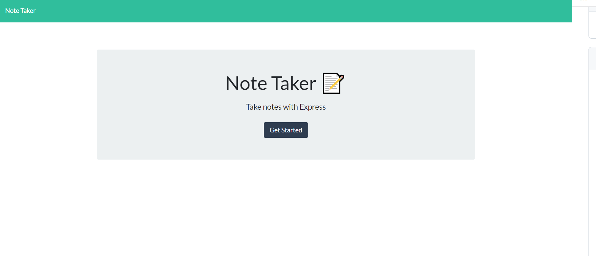

# note-taker
## Description: 
An application that can be used to write, save, and delete notes. This application uses express backend and saves and retrieves note data from a JSON file.

## User Story
- AS A busy entrepreneur
- I WANT to be able to write and save notes
- SO THAT I can organize my thoughts and keep track of tasks I need to complete

## List of Technology
- Javascript
- HTML
- CSS 
- Express.js
- Node.js

## Installation 
Clone a copy from GitHub. 
Open project directory, then npm install to install all dependencies

## Usage 
1. node server.js
2. navigate to localhost:3001
3. Click "Get Started"
4. Add a note title and any note text then press the save icon in the top right corner
5. To create a new note, click on the pencil icon
6. View your notes on the left hand side. 

## Contributions
Tammy Gagliano 
https://github.com/TammyGagliano/note-taker
Heroku Deployment
https://tg-note-taker-app.herokuapp.com/

## ScreenShot
